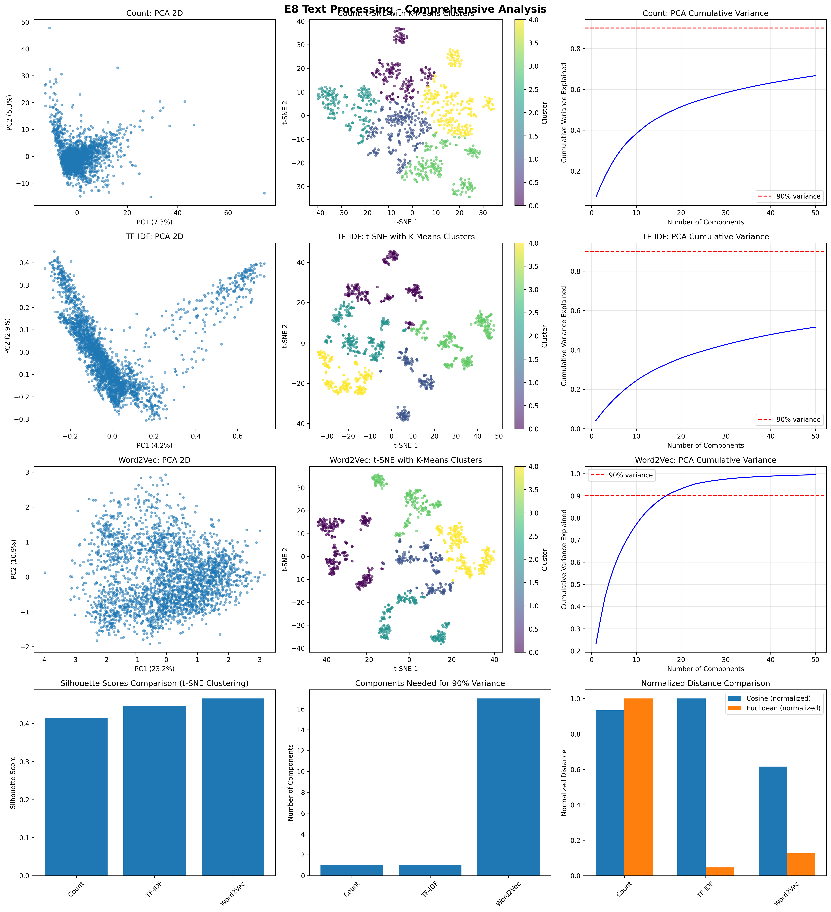
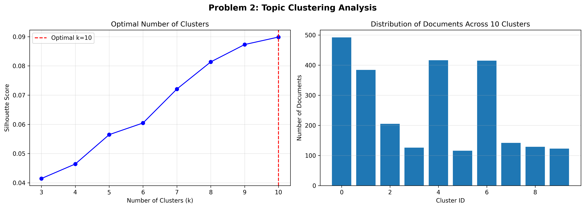

# How to Upload E8 Project to GitHub

## Prerequisites
✅ Git is already initialized (you have a .git folder)
✅ All project files are ready

## Step-by-Step Instructions

### Method 1: Using GitHub Desktop (Easiest)

1. **Download GitHub Desktop** (if not installed)
   - Go to: https://desktop.github.com/
   - Download and install

2. **Add Your Repository**
   - Open GitHub Desktop
   - File → Add Local Repository
   - Choose: `C:\Users\bansa\Desktop\E8`
   - Click "Add Repository"

3. **Create GitHub Repository**
   - Click "Publish repository" button (top right)
   - Name: `E8-Text-Processing` (or your choice)
   - Description: "Text processing and vector representation analysis"
   - Choose Public or Private
   - Uncheck "Keep this code private" if you want it public
   - Click "Publish Repository"

4. **Done!** 🎉
   - Your code is now on GitHub
   - GitHub Desktop will show the URL

---

### Method 2: Using Git Command Line

#### Step 1: Create Repository on GitHub Website

1. Go to: https://github.com/new
2. Repository name: `E8-Text-Processing`
3. Description: "Text processing and vector representation analysis for student session data"
4. Choose: Public or Private
5. **DO NOT** initialize with README, .gitignore, or license (you already have these)
6. Click "Create repository"

#### Step 2: Add Files to Git

Open PowerShell in your E8 folder and run:

```powershell
# Check what files are ready to commit
git status

# Add all project files
git add .

# Create a commit
git commit -m "Initial commit: Complete E8 text processing analysis"
```

#### Step 3: Connect to GitHub

After creating the repository on GitHub, you'll see instructions. Run these commands (replace YOUR_USERNAME with your GitHub username):

```powershell
# Add GitHub as remote
git remote add origin https://github.com/YOUR_USERNAME/E8-Text-Processing.git

# Push to GitHub
git branch -M main
git push -u origin main
```

#### Step 4: Enter GitHub Credentials

When prompted:
- **Username**: Your GitHub username
- **Password**: Use a Personal Access Token (not your password)

**To create a token:**
1. Go to: https://github.com/settings/tokens
2. Click "Generate new token" → "Generate new token (classic)"
3. Name: "E8 Project Upload"
4. Expiration: 30 days
5. Select scopes: ✓ `repo` (all repo permissions)
6. Click "Generate token"
7. **Copy the token** (you won't see it again!)
8. Use this token as your password

---

### Method 3: Using VS Code (Built-in)

1. **Open Source Control Panel**
   - Click the Source Control icon (left sidebar) or press `Ctrl+Shift+G`

2. **Stage All Changes**
   - Click the "+" icon next to "Changes" to stage all files
   - Or click "+" next to individual files

3. **Commit Changes**
   - Type a commit message: "Initial commit: Complete E8 analysis"
   - Click the checkmark (✓) or press `Ctrl+Enter`

4. **Publish to GitHub**
   - Click "Publish Branch" or "Publish to GitHub"
   - Choose repository name: `E8-Text-Processing`
   - Choose Public or Private
   - Click "Publish"

5. **Sign in to GitHub** (if prompted)
   - VS Code will open browser
   - Authorize VS Code to access GitHub
   - Done!

---

## What Gets Uploaded

Based on your `.gitignore`, the following will be **excluded**:
- `.venv/` - Virtual environment (large, should be recreated)
- `__pycache__/` - Python cache files
- `*.pyc` - Compiled Python files
- `.python-version` - Local Python version

**These WILL be uploaded:**
- ✅ `e8_solution.py` - Your main solution
- ✅ `E8_Analysis_Report.md` - Report document
- ✅ `SUBMISSION_CHECKLIST.md` - Checklist
- ✅ All PNG visualizations
- ✅ CSV data files
- ✅ `README.md`, `pyproject.toml`
- ✅ Supporting Python files

---

## After Uploading

### View Your Repository
Your project will be at: `https://github.com/YOUR_USERNAME/E8-Text-Processing`

### Add a Nice README
The `README.md` already exists, but you might want to enhance it with:
- Project overview
- Installation instructions
- How to run the analysis
- Sample visualizations
- Key findings

### Share Your Work
You can now share the GitHub URL:
- In your assignment submission
- On your resume/portfolio
- With recruiters/interviewers

---

## Quick Command Reference

```powershell
# Check status
git status

# Add all files
git add .

# Commit changes
git commit -m "Your commit message"

# Push to GitHub (after first setup)
git push

# Pull latest changes
git pull

# View commit history
git log --oneline
```

---

## Common Issues & Solutions

### Issue 1: "fatal: remote origin already exists"
```powershell
# Remove existing remote and add new one
git remote remove origin
git remote add origin https://github.com/YOUR_USERNAME/E8-Text-Processing.git
```

### Issue 2: Authentication Failed
- Use Personal Access Token instead of password
- Or use GitHub Desktop (handles auth automatically)

### Issue 3: Large Files Warning
If you get warnings about large files:
```powershell
# Check file sizes
git ls-files | ForEach-Object { Get-Item $_ } | Sort-Object Length -Descending | Select-Object Name, Length -First 10
```

CSV files might be large. If GitHub rejects them (>100MB):
- Add them to `.gitignore`
- Use Git LFS (Large File Storage)
- Or upload to Google Drive and link in README

### Issue 4: "Nothing to commit"
If git says nothing to commit:
```powershell
# Check what's ignored
git status --ignored

# Force add specific file if needed
git add -f filename.csv
```

---

## Best Practices

### 1. Good Commit Messages
```powershell
# ✅ Good
git commit -m "Add PCA visualization for TF-IDF vectors"
git commit -m "Fix preprocessing to handle empty documents"
git commit -m "Complete problem 3: student learning patterns"

# ❌ Bad
git commit -m "updates"
git commit -m "fix"
git commit -m "asdf"
```

### 2. Don't Commit Sensitive Data
Never commit:
- API keys
- Passwords
- Personal student information (if any)
- Large datasets (>50MB)

### 3. Regular Commits
Make commits as you work:
```powershell
git add .
git commit -m "Complete preprocessing step"
git push
```

### 4. Create a .gitignore
Already done! Your `.gitignore` excludes:
- Virtual environments
- Cache files
- OS files
- IDE settings

---

## Example: Complete Upload Process

Here's the full sequence of commands to run:

```powershell
# 1. Navigate to your project
cd C:\Users\bansa\Desktop\E8

# 2. Check status
git status

# 3. Add all files
git add .

# 4. Commit
git commit -m "Initial commit: Complete E8 text processing and analysis

- Implemented text preprocessing with NLTK
- Created Count, TF-IDF, and Word2Vec vectorizations
- Performed distance analysis and clustering
- Completed 3 custom problems
- Generated comprehensive visualizations and report"

# 5. Create repository on GitHub website first, then:
git remote add origin https://github.com/YOUR_USERNAME/E8-Text-Processing.git

# 6. Push to GitHub
git branch -M main
git push -u origin main

# 7. Enter your GitHub username and Personal Access Token when prompted
```

---

## Making Your Repository Stand Out

### Add Badges to README.md
```markdown


```

### Add Screenshots
Include visualization images in your README:
```markdown
## Sample Visualizations

### PCA Analysis


### Topic Clustering

```

### Add Installation Instructions
```markdown
## Setup

1. Clone the repository:
\`\`\`bash
git clone https://github.com/YOUR_USERNAME/E8-Text-Processing.git
cd E8-Text-Processing
\`\`\`

2. Create virtual environment:
\`\`\`bash
python -m venv .venv
.venv\Scripts\activate  # Windows
\`\`\`

3. Install dependencies:
\`\`\`bash
pip install -r requirements.txt
\`\`\`

4. Run analysis:
\`\`\`bash
python e8_solution.py
\`\`\`
```

---

## Next Steps After Upload

1. ✅ Verify repository is public/private as intended
2. ✅ Check that all files uploaded correctly
3. ✅ Add repository URL to your assignment submission
4. ✅ Consider adding it to your LinkedIn/portfolio
5. ✅ Share with potential employers

---

**Ready to Upload?** Choose Method 1 (GitHub Desktop) for easiest experience, or Method 2 (Command Line) for more control!

**Questions?** Check GitHub's documentation: https://docs.github.com/en/get-started
